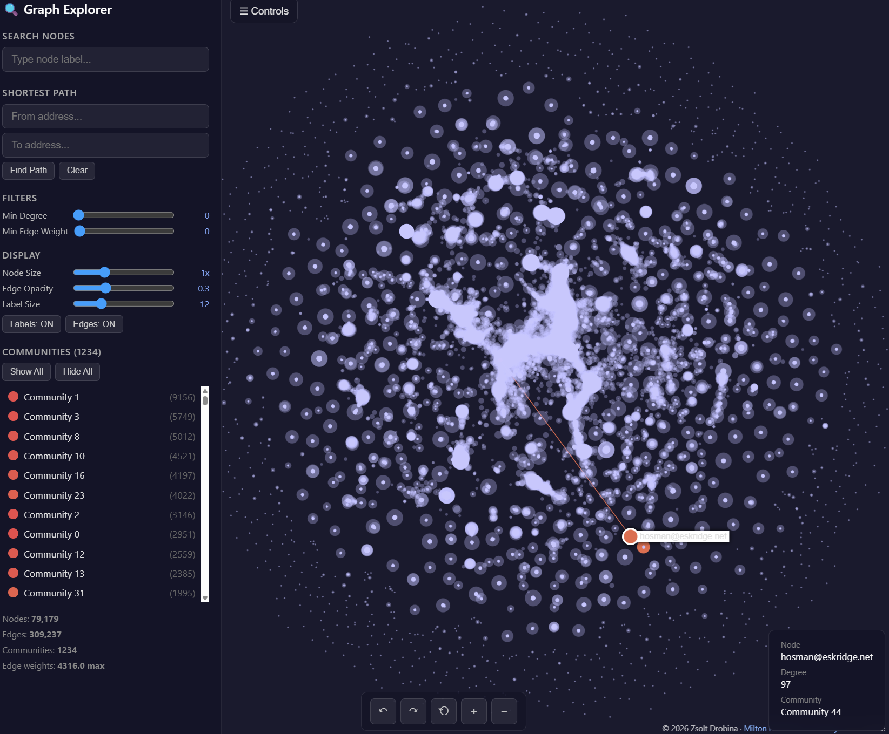
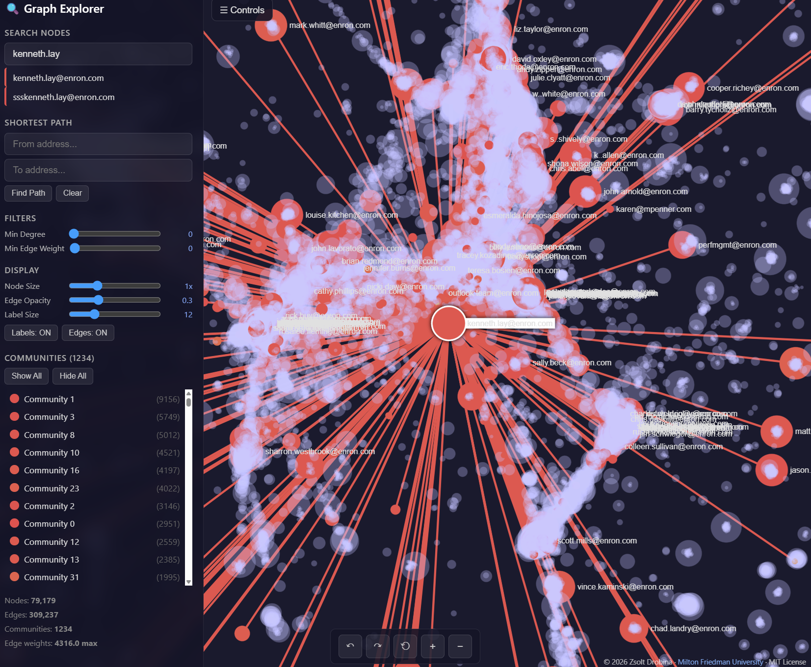

# Defence Against OSINT-Based Spear-Phishing Attacks - A Relationship Trust Scoring Approach

> **B.Sc. Thesis - Milton Friedman University**
> Zsolt Drobina, 2026

This repository contains the implementation of the five-stage pipeline architecture: **Parse → Build → Score → Inject → Evaluate**.

<p align="center"></p>

---

## Releases

- **v1.0** - [Download ZIP](https://github.com/GL0LFK/thesis_rss_osint/archive/refs/tags/v1.0.zip)
---

## File Descriptions

| File | Description |
|---|---|
| `config.py` | Central path configuration; defines `BASE_PATH` and all data sub-folder / artefact paths used by every stage. |
| `utils.py` | Shared stateless helper functions: `normalise_address()` for lowercase/strip and `strip_tzinfo()` to make datetimes timezone-naive. |
| `stage1_parse.py` | **Stage 1** - Walks the raw Enron maildir tree, parses each email with `mail-parser`, normalises addresses, deduplicates by Message-ID, expands multi-recipient messages, drops self-loops, and writes `enron_parsed.csv`. |
| `stage2_build.py` | **Stage 2** - Reads `enron_parsed.csv`, aggregates sender→recipient message counts into a directed weighted NetworkX graph with per-edge timestamp lists, asserts zero self-loops, computes graph statistics, and serialises `graph.graphml`. |
| `stage3_score.py` | **Stage 3** - Loads `graph.graphml`, computes six sub-scores (trust degree, reciprocity, interaction average, response time, clustering coefficient, betweenness centrality) per directed edge, and writes the composite RSS to `score_table.csv`. |
| `stage4_inject.py` | **Stage 4** - Reads `score_table.csv` and OSINT-level configs, injects synthetic spear-phishing rows at three OSINT levels (Low, Medium, High) with deterministic RNGs, and writes the labelled `evaluation_set.csv`. |
| `stage5_evaluate.py` | **Stage 5** - Runs the full evaluation pipeline: splits data into validation/test sets, sweeps τ on validation, then evaluates Methods A (RSS), B (Header Auth), and C (Hybrid) with TPR / FPR / F1 / AUC-ROC metrics and statistical tests. |
| `stage5_analysis_high.py` | **Stage 5 supplement** - Performs a deep-dive on High-OSINT test-set rows, merges sub-scores from the score table, and produces `high_osint_subscore_profile.csv` and `tau_tradeoff_table.csv`. |
| `stage5_charts_extra_v11.py` | **Stage 5 supplement** - Generates all thesis charts (degree CCDF, ROC curve, TPR/F1 bar charts, RSS distributions, confusion matrices, τ sweep, detection outcomes) as PNG files. |
| `edge_diagnostic.py` | Diagnostic utility that inspects individual graph edges and prints debug information for troubleshooting score calculations. |
| `graph_viewer_generator.py` | Generates the interactive HTML graph viewer from `graph.graphml` using igraph + sigma.js. |
| `Thesis_Enron_dir_w_graph.html` | Interactive HTML visualisation of the full Enron communication graph for exploratory analysis. |

---

## Usage

1. **Create the folder structure** (or tailor `config.py` to reflect your environment):

   ```
   data/
   ├── 00_Raw/
   ├── 01_Interim/
   ├── 02_Processed/
   ├── 03_Labels_Attack_Injection/
   └── 99_Data_Dictionary/
   ```

2. Download the `enron_mail_20150507.tar.gz` into `data/00_Raw/` from https://www.cs.cmu.edu/~enron/enron_mail_20150507.tar.gz

3. **Extract** the `enron_mail_20150507.tar.gz` into `data/00_Raw/`

4. **Run each stage** sequentially:

   ```bash
   python src/stage1_parse.py
   python src/stage2_build.py
   python src/stage3_score.py
   python src/stage4_inject.py
   python src/stage5_evaluate.py
   ```

5. **Optional**:
   - Run `stage5_analysis_high.py` to inspect impersonated sender–recipient pairs at the High OSINT level.
   - Run `stage5_charts_extra_v11.py` to generate all thesis charts.
   - Run `edge_diagnostic.py` to inspect the single false positive or any other edge pair.

---

## Graph Viewer

Explore the constructed Enron communication graph in your browser - open `Thesis_Enron_dir_w_graph.html`.

<p align="center"></p>
<p align="center"></p>

**Features:**
- Node search
- Shortest-path search between two addresses
- Community detection with toggle on/off
- Edge weight filter (slider)
- Degree filter (slider)
- Node / edge size controls
- Hover highlights neighbours
- Click to focus
- Rotate / zoom controls
- Dark mode

---

## License

This project is licensed under the [MIT License](LICENSE).

© 2026 Zsolt Drobina - [Milton Friedman University](https://uni-milton.hu/)
